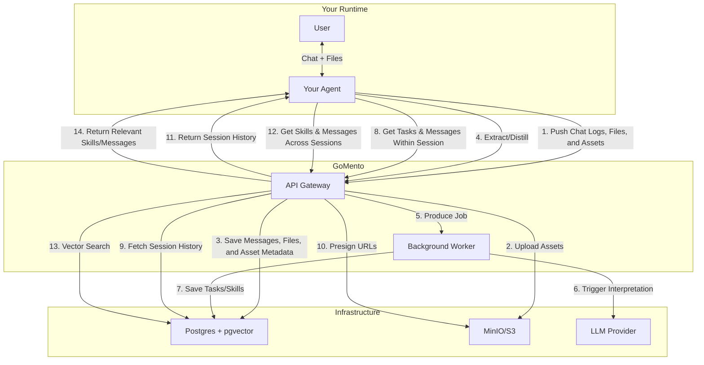
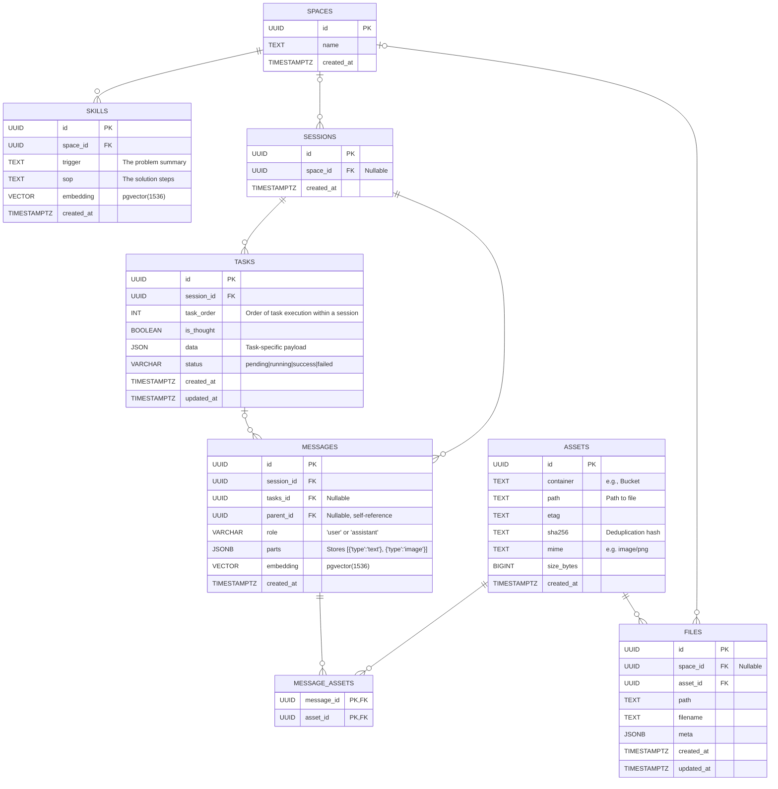

# gomento

## Problem

If your agent solves a complex bug today, and you ask it to solve the same bug next week, it starts from scratch. It doesn't remember the solution; it just has a massive log file that it can't read efficiently.

Agents make the same mistakes repeatedly because their successes are buried in raw logs. They don't learn; they just execute.

## Solution

GoMento is a high-performance, single-binary sidecar written in **Go**. It accepts raw chat logs and files, uses a background worker to (a) **extract** a summary of the current session and (b) **distill** the current session into skills that are not session-bound, and makes all this memory easily searchable for your agent.

### Usage

```bash
docker compose -f docker-compose.demo.yml up
make migrate-up
```

### Architecture



### ER Diagram

