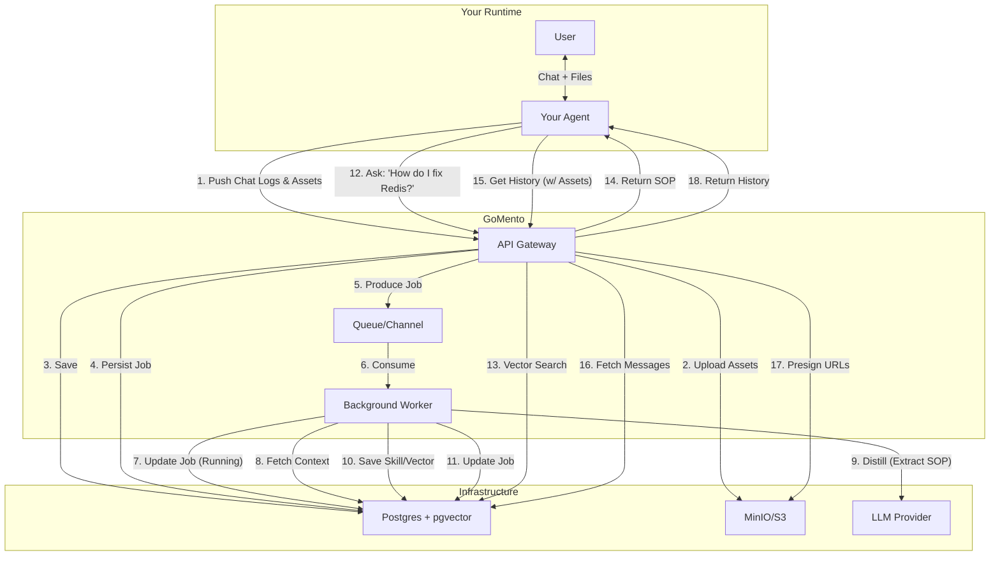
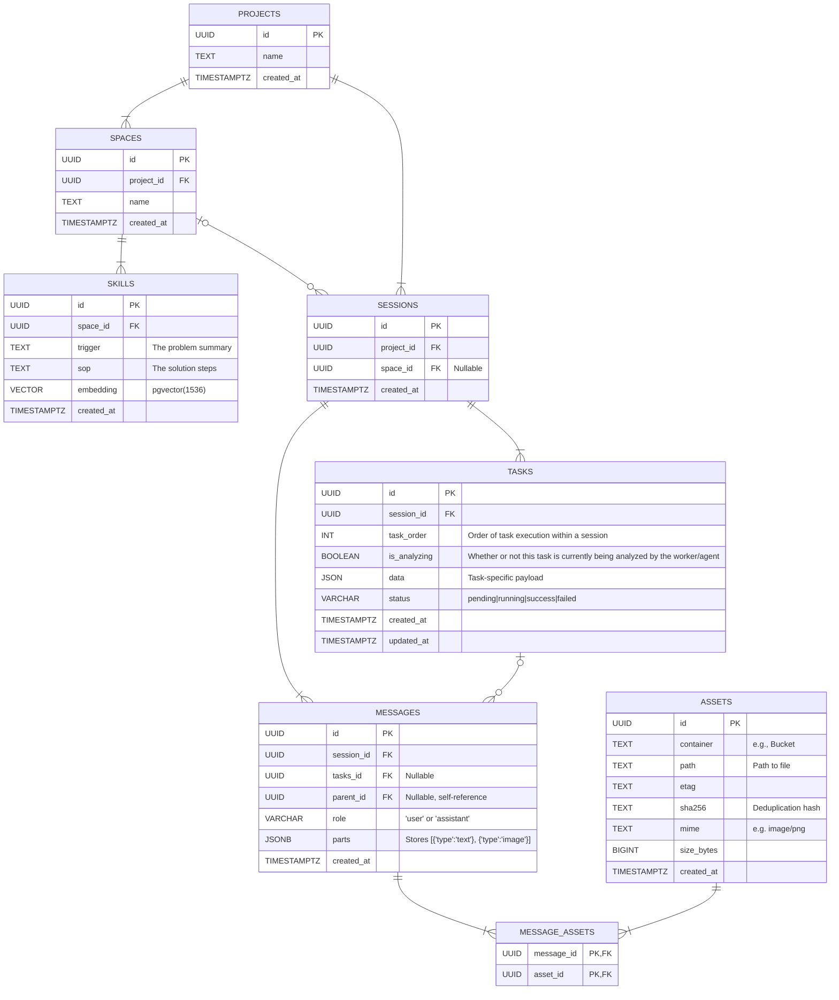

# gomento

## Problem

If your agent solves a complex bug today, and you ask it to solve the same bug next week, it starts from scratch. It doesn't remember the solution; it just has a massive log file that it can't read efficiently.

Agents make the same mistakes repeatedly because their successes are buried in raw logs. They don't learn; they just execute.

## Solution

GoMento is a high-performance, single-binary sidecar written in **Go**. It accepts raw chat logs, uses a background worker to **distill** those logs into SOPs (Standard Operating Procedures), and makes them searchable for your agent next time.

### Usage

```bash
docker compose up
make migrate-up
go run main.go server
```

### Architecture



### ER Diagram

