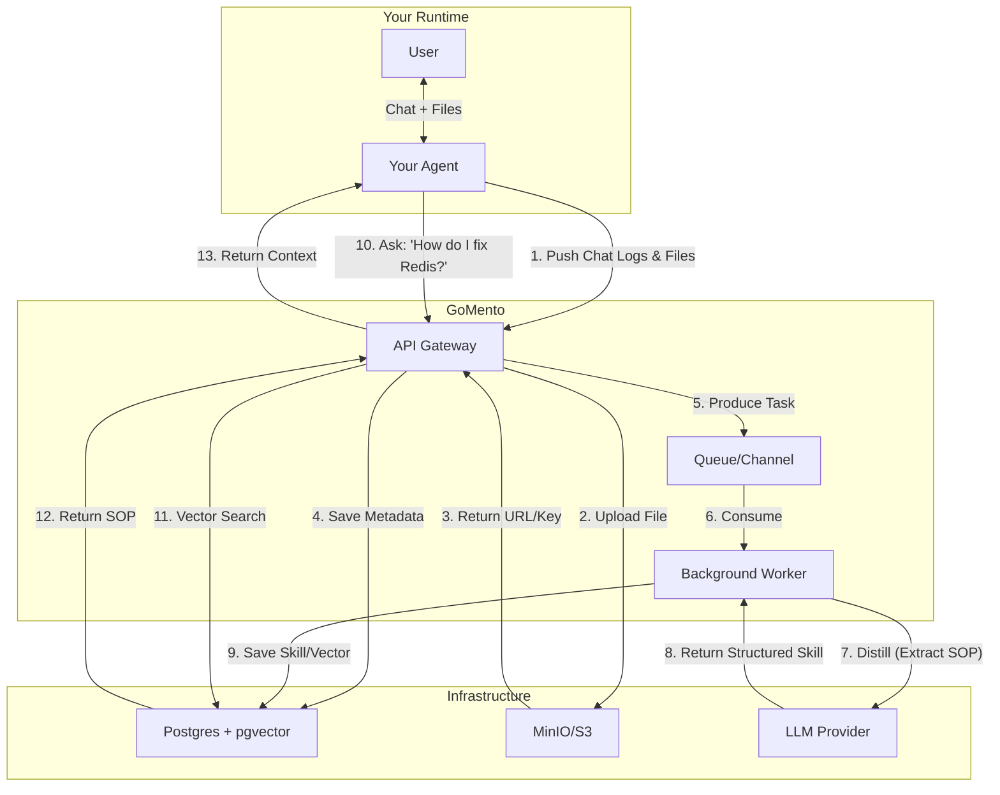
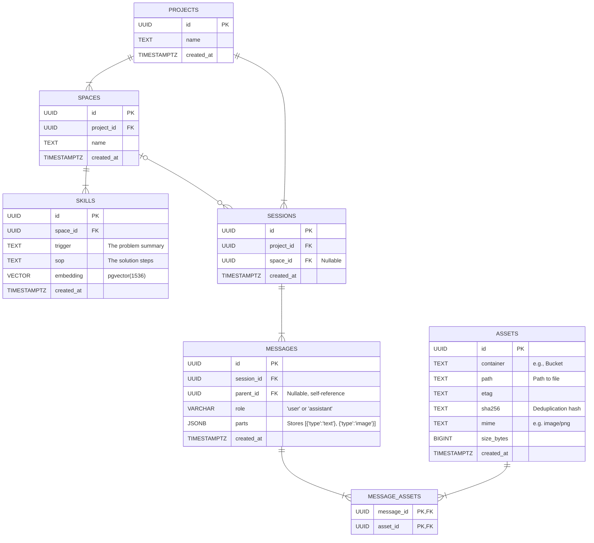

# gomento

## Problem

If your agent solves a complex bug today, and you ask it to solve the same bug next week, it starts from scratch. It doesn't remember the solution; it just has a massive log file that it can't read efficiently.

Agents make the same mistakes repeatedly because their successes are buried in raw logs. They don't learn; they just execute.

## Solution

GoMento is a high-performance, single-binary sidecar written in **Go**. It accepts raw chat logs, uses a background worker to **distill** those logs into SOPs (Standard Operating Procedures), and makes them searchable for your agent next time.

### Usage

```bash
docker compose up

make migrate-up

go run main.go server

curl -X POST localhost:4000/api/v1/projects -H "Content-Type: application/json" -d '{"name":"myproject"}'

curl -X POST localhost:4000/api/v1/spaces -H "Content-Type: application/json" -d '{"project_id":"$PROJECT_ID","name":"devops"}'

curl -X POST localhost:4000/api/v1/sessions -H "Content-Type: application/json" -d '{"project_id":"$PROJECT_ID","space_id":"$SPACE_ID"}'

curl -X POST localhost:4000/api/v1/sessions/$SESSION_ID/messages -H "Content-Type: multipart/form-data" -F "role=user" -F "parts=[{\"type\":\"text\",\"text\":\"Here is the log:\"},{\"type\":\"file\",\"file_field\":\"logfile\"}]" -F "logfile=@test/files/crash.log"

curl -X POST localhost:4000/api/v1/sessions/$SESSION_ID/finish

# check minio at localhost:9000

# check postgres with make pg-connect

docker compose down
```

### Architecture



### ER Diagram

